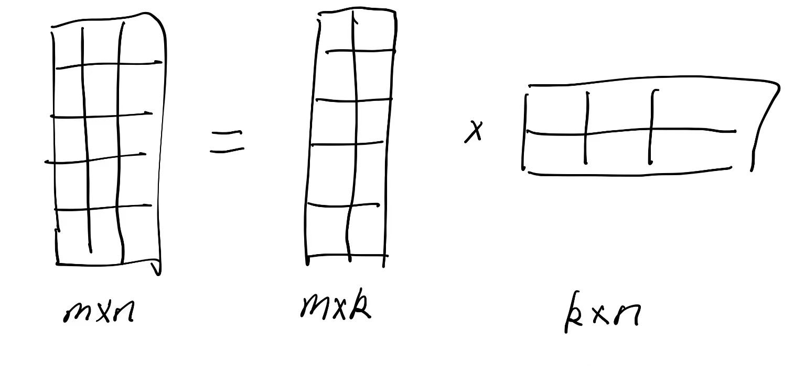
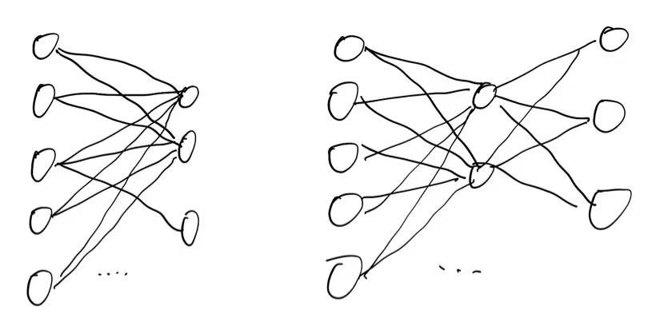

The rank decomposition method is useful in algebra area, however, I'm a little confused about how to use it in deep learning, here is just my some thinkings.

## What is rank decomposition? 

Rank decomposition is a method to decompose a matrix into some product of smaller matrices. For example, (if possible) let the oringal matrix $A$ be decomposed into $A = BC$, where $B$ is a $m \times k$ matrix and $C$ is a $k \times n$ matrix. Then the rank of $A$ is at most $k$.

## Why is it useful in deep learning?
Take [Lora](https://arxiv.org/abs/2106.09685) as an example, to make the model fine-tuning more efficient, the authors decompose some dense matrix in the model into some product of smaller matrices, though actually the original matrix are kept while fine-tuning, the decomposed matrices are used to calculate and update the gradients (So you can view it as adding another sideway).

These are very similar to the 1x1 convolution kernel (refer to my previous [post](https://timturing.github.io/1x1-convolution-kernel-in-deep-learning/)) and adapter tuning method. Adapter tuning incorporates small neural network modules (called adapter) into the Transformer models. To implement the adapter module, a bottleneck architecture has been proposed in, which first compresses the original feature vector into a smaller dimension (followed by a nonlinear transformation) and then recovers it to the original dimension.

Like the picture I draw below, we can understand why it's a useful method. Let's say the original matrix is $A$, which has a size of $m \times n$, and we decompose it into $A = BC$, where $B$ is a $m \times k$ matrix and $C$ is a $k \times n$ matrix. If the number k is small enough, then we have $m \times k + k \times n$ parameters, which is much smaller than $m \times n$. If k is just 1, then we have $m + n$ parameters. It's a little bit like the time complexity relationship between brute-force and kmp algorithm in string matching.

Also, the network structure shown below indicates a lower connection between the input and output.