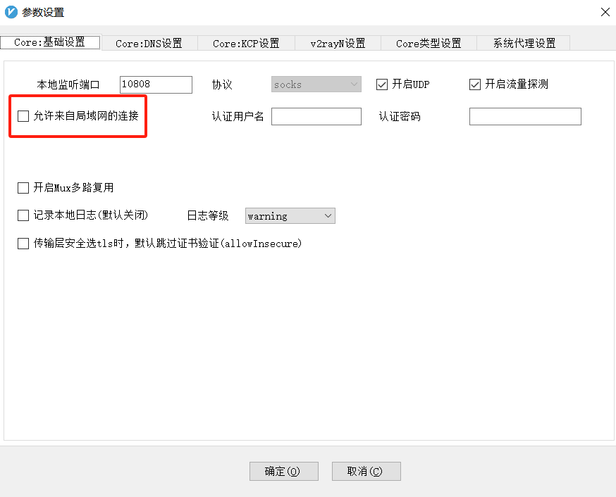
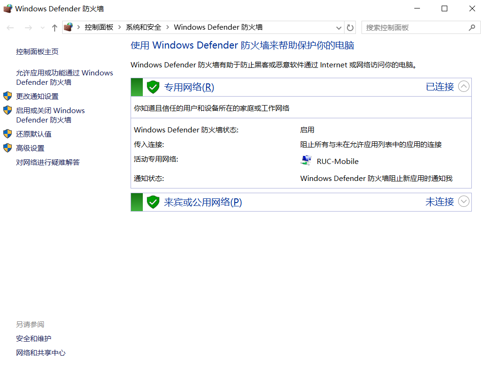
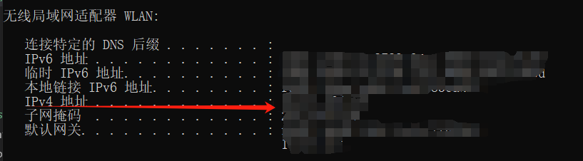

由于某些众所周知的原因，我们无法在国内的服务器上访问github和huggingface之类的科研资源，但是大家普遍在自己的电脑上有梯子，所以我们可以通过在本地搭建代理服务器来实现在服务器上访问这些资源。当然，如果有服务器的sudo权限，也可以参考其他博客直接配置服务器上的代理，这里不再赘述。

目前本教程只涉及局域网下的代理，如果人在校外/公司外，可以通过easyconnect等工具连接到校园网，然后再使用新分配的局域网IP，这样就可以访问了。

使用工具：
- 本机v2rayN
- 可以连接的服务器(如ssh)
  
目的：
- 服务器通过本机v2rayN访问github等资源

注：本方法较为繁琐，只作为权宜之计使用。且存在一定的网络风险。

## 1. 基础知识
专用网络/公用网络：简单理解就是你自己把外面的网络分成两类，一类可信度高一些，比如你经常要连的（家，公司，学校），这些你大概率不会遇到有人对你进行网络攻击） 另一类就是可信度低一点的，一般就是临时使用的场所。比如咖啡厅，机场，火车站，酒店等等。这些地方你不知道有没有人在监听你的网络，所以你要保护自己的网络安全。

代理服务器端口：一般来说，代理服务器会监听一个端口，比如10808，这个端口就是你的代理服务器的端口，你的代理服务器会监听这个端口，等待你的请求，然后把你的请求转发到目标服务器，然后再把目标服务器的响应转发给你。

## 2. 开启v2rayN的局域网代理
默认的监听端口是10808，然后会有一个这样的设置：（不同版本的v2ray，这个按钮的位置可能不一样，但是应该是都有的）

选中即可。

这里第一次设置可能会出现让你选择xray core允许通过的网络类型，一般建议专用网络。

旁边的登录账号密码可以设置一下，本文暂未探讨该设置。

## 3. 本机防火墙设置
这里以windows防火墙为例，其他防火墙类似。

现在防火墙都是绿色的，也就是保护你的电脑的状态，基本上端口都封闭了，别人访问不了你的电脑。简单的操作就是把防火墙先关闭了，当然如果继续仔细配置的话，可以选择性的只开放这个v2ray的端口。

简单理解就是windows defender是第一层防火墙，你的应用程序也有自己的防火墙，他们都会过滤从而只让某些请求通过。

这里可以直接点击左边的`启用或关闭防火墙`，然后把防火墙关闭，这样就可以让别人访问你的电脑了。

## 4. 服务器端设置
首先在本机的cmd里面输入`ipconfig`，查看本机的ip地址：

这里的ipv4地址就是你的本机内网地址。我们假设是`10.47.104.58`。

> 以下IP段范围内的地址都是内网IP地址：
>（1）10.0.0.0 到 10.255.255.255
>（2）192.168.0.0 到192.168.255.255
>（3）172.16.0.0 到172.31.255.255

然后登录你的服务器，在服务器端`ping`一下你的这个地址，如果能够联通，说明访问基本没有问题。

这个时候只需要`export http_proxy=http://10.47.104.58:10811`,`export https_proxy=http://10.47.104.58:10811`就可以临时使用了。（因为内网IP经常是通过DHCP分配的动态ip，所以没办法写死在`~/.bashrc`里面；这里是10811端口是因为v2rayN内部占用端口会逐渐+1，然后莫名其妙就占完了，如果配置过本机程序走代理的话，可能会知道用的是10809，也不是10808。）

可以使用指令`curl -I http://google.com`来测试一下，只要没有卡死或者拒绝访问，那么就是成功了。（这个网址好像已经301 Moved Permanently，有这个结果应该就是访问成功了）

## 5. 通过easyconnect连接校园网获得局域网ip
连接成功后，仍然是使用ipconfig，会发现多了一个以太网适配器的ip，这个就是我们需要的局域网ip。格式应该与真正连接校园网的ip类似，只会稍有不同，在上面的步骤中用这个ip就可以了。
